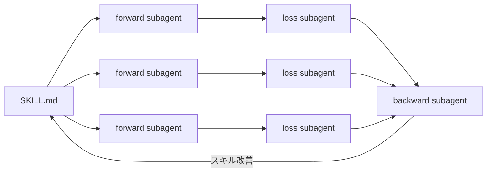

# Skills Tuning

Agent Skillsを、自動チューニングする実験的フレームワークです。

## 試し方

```bash
git clone https://github.com/shure-dev/skills-tuning.git
cd skills-tuning
```

Claude Code を開いて、同梱の例（Xポスト生成）を動かす:

```
/skills-tuning examples/x-post-generation
```

結果は `examples/x-post-generation/runs/exp_01/` に出力されます。

## ワークフロー

input（入力素材）と reference（人間が作ったお手本）のペアを用意すると、スキルが自動で改善されます。

### Step 1: ベースライン計測

最小限のスキル（ほぼ空）で全ケース実行し、素のモデルの実力を測る。

- **forward subagent × N並列**: スキル + input → output を生成
- **loss subagent × N並列**: output と reference を比較 → score を算出

### Step 2: ベーススキル構築

- **base-skill-builder subagent × 1**: 全ケースの reference と input を読み込み、共通パターンを抽出してスキルを構築
- コンテキストが大きくなるので親から分離してサブエージェントで実行

### Step 3: ベーススキルで評価

構築したスキルで全ケース再評価する。

- **forward subagent × N並列** → **loss subagent × N並列**

### Step 4: チューニング

- **backward subagent × 1**: 全ケースの score・judgment-log・output・reference を読み、スキルのどの記述が問題か特定して編集
- **forward subagent × N並列** → **loss subagent × N並列**: 更新後のスキルで再評価

### Step 5: 結果比較

3ステップのスコアを比較する。

```
without-skill  | 65.0  | ベースライン
base-skill     | 72.2  | +7.2
tuned          | 74.5  | +2.3
```

## forward → loss → backward ループ (Step3~4)



| サブエージェント | 役割 |
|---|---|
| **forward** | スキルの指示に従って input から output を生成する。reference は読めない（Hook で制限） |
| **loss** | output を reference と比較してスコアを算出する。スキルは読めない（Hook で制限） |
| **backward** | 全ケースの score を集約し、スキルのどの記述が問題か特定して編集する |
| **base-skill-builder** | 全ケースの reference を分析し、共通パターンを抽出して初期スキルを構築する |
