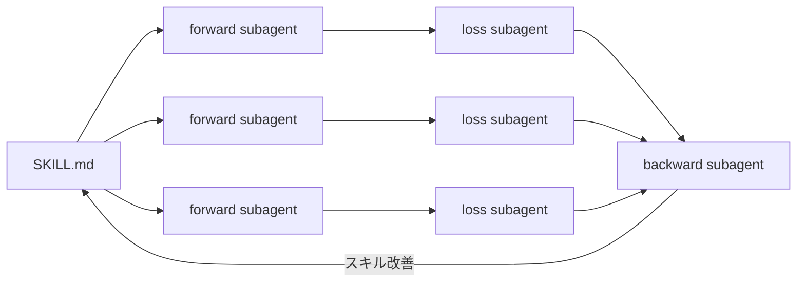

# Skills Tuning

Agent Skillsを、自動チューニングする実験的フレームワークです。

## 試し方

```bash
git clone https://github.com/shure-dev/skills-tuning.git
cd skills-tuning
```

Claude Code を開いて、同梱の例（Xポスト生成）を動かす:

```
/skills-tuning examples/x-post-generation
```

結果は `examples/x-post-generation/runs/exp_01/` に出力されます。

## 仕組み

サブエージェントで forward → loss → backward のループを回し、スキルを自動改善します。

